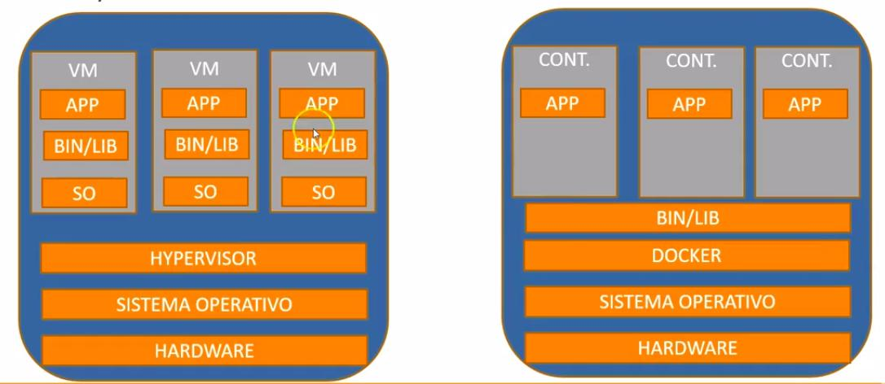
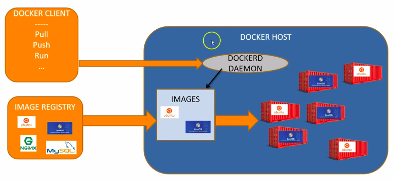
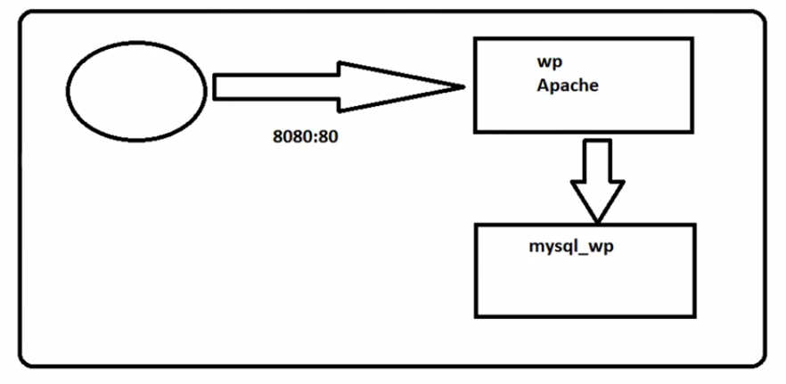
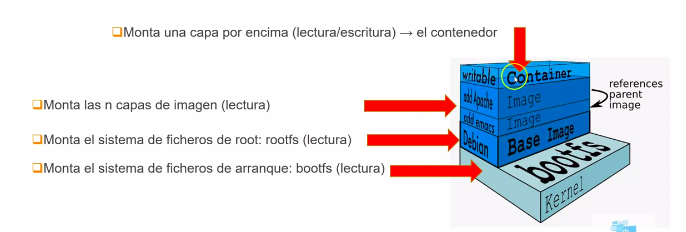

# Apuntes de las diapositivas

El curso de Udemy es https://www.udemy.com/course/aprende-docker-desde-cero

---
## Seccion 1. Introduccion al curso
---
### 3 Introduccion a Docker
- Encapsula todas las dependencias de un proyecto de manera transparente.
- Actualmente va en la versión 18? Checar.
    • La idea viene de los contenedores de barcos. Una caja de determinadas medidas pero no me importa lo que hay adentro.

### 4 Diferencias con máquinas virtuales
- Los contenedores comparten recursos binarios y libs con el sitema operativo host.



- Hay dos versiones:
  - Community (CE)
    - Stable: para producción
    - Edge: lo más moderno
  - Enterprise (EE)
    - Basic
    - Standard
    - Advance
- Los sistemas operativos de Community Edition funciona con Windows y Ubuntu. En plataformas cloud hay para AWS, Azure e IBM Cloud.

### 6 Instrucciones de instalación
- Aquí estan las instrucciones para Ubuntu: https://docs.docker.com/install/linux/docker-ce/ubuntu/
- Instale la version 19.03

### 14 Arquitectura de Docker. Imagenes, Containers y Daemons
- dockerd: es el daemon que puede ser visto desde el manedor de procesos.
- Docker client: la manera de interactuar con Docker. En este caso el cli. Se conecta al dockerd para decirle que hacer.
- Imagen: es una plantilla de un determinado contenedor. Puede tener por ejemplo Ubuntu, Python y Git.
- Container: se crean a partir de una imagen. Una imagen seria la clase por ejemplo y un contenedor las instancias de la clase.



---
## Seccion 2. Trabajar con contenedores
---

### 15 Arrancar y parar docker
- Para iniciar, detener y checar el status.
```
$ systemctl start docker
$ systemctl status docker
$ systemctl stop docker
```
- Ademas de arrancarlo debemos activar docker. Esto significa que al iniciar o reiniciar el sistema docker se va a reiniciar tambien.
```
$ systemctl enable docker
```
- Tambien se puede con `service start docker` por ejemplo. Este es el comando anterior. Ahora funciona con systemctl.

### 17 Crear nuestro primer contenedor
- Comandos importantes
  - `docker -v`
  - `sudo docker info`: obtener información de memoria y de contenedores funcionando.
- Al correr  `docker run hello-world` docker busca una plantilla local que se llame asi, si no la encuentra la busca en docker hub. Entonces las descarga y crea un contenedor basado en esa plantilla.

### 18 Ver imagenes y contenedores Parte 1
- `sudo docker images` para mostrar las imagenes en local.
- Al correr un contenedor este no se elimina. Se queda con status parado.
- `sudo docker ps` muestra los contenedores. Si agregamos `sudo docker ps -a` tenemos los contenedores inactivos. Se puede tener mas de un contenedor de una misma imagen.

### 19 Ver imagenes y contenedores Parte 2
- `docker ps --help` para ayuda sobre los contenedores existentes.
- `docker ps -l` el  ultimo contenedor.
- `docker -n 3` muestra los ultimos 3 por ejemplo.

### 21 Crear un contenedor interactivo
- En modo interactivo se pone el prompt root@296e28b4d8ab. El segundo numero es el id del contenedor.
- Cuando se corre el comando run se crea un contenedor nuevo. Para reutilizar uno que ya existe hay que usar un comando como `docker start -i 296e28b4d8ab`.

### 23 Crear un contenedor en background
- `docker run -d nginx` corre un contenedor con nginx en modo dettached. Por eso es la -d.

### 27 Docker Hub Parte 1: tags y pulls
- Aqui estan las imagenes que se descargan al darle docker run.
- Al darle docker ps aparece el nombre del repositorio en la primera columna, el tag es la version del repositorio que es realmente la imagen.
- Si no le digo cual etiqueta busca la que dice latest.
- `sudo docker pull ubuntu:trusty` lo que hace es descargar la imagen pero no crea el contenedor. ubuntu:trusty quiere decir que baje la etiqueta trusty del repositorio ubuntu.

### 32 Borrar imagenes y contenedores
- `sudo docker rm 296e28b4d8ab` elimina el contendor con ese id.
- `sudo docker rm 296e28b4d8ab` elimina el contenedor con el nombre interesting_yonath.
- `sudo docker rmi 6d5fcfe5ff17` elimina una imagen con ese id.
- `sudo docker rmi -f 6d5fcfe5ff17` elimina la imagen y los contenedores que la usen tambien.

### 33 Docker Exec: ejecutar comandos contra contenedores
- `docker -run -it --name mi_ubuntu ubuntu bash` crea de manera interactiva un contenedor basado en la imagen ubuntu y el nombre mi_ubuntu y entra a la bash.
- `docker exec mi_ubuntu echo hola` corre el comando echo hola en el contenedor mi_ubuntu.
- `exec` es mas para tareas administrativas que para poner algo en produccion.
- `docker exec nginx1 /bin/sh -c 'for i in *; do echo "ficheroi -->" $i ; done'` para correr un script bash en un contendor que ya funciona.

### 35 Comandos Docker Image y Docker Container
- `docker image ls`, `docker image rm` son como subcomandos de imagenes de docker.
- `docker container ls`, `docker container rm` igual, son subcomandos de contenedores de docker.
- `docker container ls --help` para mostrar la ayuda del comando. Funciona tambien para imagenes.

### 36 Docker logs y docker kill
- Cuando se corre un comando en el modo -d no se ve en la pantalla lo que hace, a veces seria util poder hacerlo.
- `sudo docker run -d ubuntu sh -c "while true; do date; done"` corre un contenedor y un comando, para poder ver que se imprimio en la pantalla uso logs `sudo docker logs 2afc222fe419 --tail 10
`. Enmedio va el id del contenedor.  
- Puedo terminar el contenedor con `sudo docker kill 2afc222fe419`.

### 37 Docker top, docker stats
- `sudo docker top fbc1` muestra los procesos dentro de un contenedor.
- `sudo dockker stats fbc1` muestra el consumo de recursos de un contenedor.   

### 39 Docker inspect
- `docker inspect fbc1 > container.txt` proporciona información técnica (propiedades) del contenedor y lo guarda en un archivo.
- `dicker inspect ubuntu:latest > image.txt` proporciona información de la imagen.

---
## Seccion 3. Redes en Docker
---

### 41 Introduccion a los puertos en docker

- Por defecto los puertos en docker son privados.
- Debemos hacerlos publicos y mapearlos a un puerto del host donde corre el contenedor.


### 42 Gestionar puertos para acceder al contenedor
- `sudo docker run -d -P nginx` mapea todos los puertos del contenedor al host.
- `docker run -d --name nginx_2 -p 8080:80 nginx` accedo al puerto 80 del contenedor por el puerto 8080 de la maquina fisica.

### 44 Redes en docker
- `docker network ls` muestra las redes.
  - bridge es la red que utiliza docker por default.
  - los contenedores que pertenecen a la red host no se pueden ver entre si.
  - red none es un contenedor que no tiene red.
- A las redes de tipo bridge se le van agregando los contenedores. Las IP son consecutivas dentro de docker.
- ¿Como sabemos a que red pertenece un contenedor? `docker inspect nginx_3 > nginx_2.txt`. Dentro de NetworkSettings aparece bridge, tambien el mapeo de puertos.

### 44 Inspeccionar una red
- `docker network inspect bridge` para analizar la red bridge. Se muestra la subred y el rango de ips, ademas de los contenedores asociados a esta red.
- Si yo quiero saber que contenedores estan en una red lo mejor es verlo directamente en la red en lugar de mirar contenedor por contenedor.
- `sudo docker port mongo_2` con este comando miramos los puertos por los que un contenedor escucha.

### 46 Crear una nueva red
- La red bridge que se crea automaticamente con Docker tiene algunas limitaciones.
- `docker network create --help` para mostrar la ayuda.
- `nmcli con` nos dice las conexiones que tenemos dentro del sistema operativo?

### 47 Asociar contenedores a una red
- `sudo docker run -it --name ubuntua --network red1 ubuntu` corre un contenedor al que llama ubuntua a partir de la imagen ubuntu en la red1.
- `docker network connect red2 ubuntua` conecta a la red2 el contenedor ubuntua. No lo quita de las redes a las que este asociado anteriormente.
- `docker network disconnect red2 ubuntua` lo desconecta.

### 49 Enlazar contenedores con --link
- No se recomienda usar `--link` sino contenedores personalizados.
- `sudo docker rm 'sudo docker ps -aq'` (el acento es grave, no comilla) usar **con cuidado**. Borra todos los contenedores.
- `docker run -it --rm --name b1 busybox`: el `--rm` borra el contenedor cuando termina de ejecutarse.
- `sudo docker run -it --rm --name b3 --link b1:maquina1 busybox` enlaza la maquina b3 con la b1 pero de manera unidireccional. `--link` no hace que b1 *vea* a b3. Tendria que usar la IP.  

### 51 Enlazar contenedores en redes personalizadas
- `docker run -d --name mysqlserver --rm --network red1 -e MYSQL_ROOT_PASSWORD=secret mysql` crea un contenedor con mysql y lo asigna a la red1. `MYSQL_ROOT_PASSWORD` es requerido por el contenedor como contraseña de la base de datos. No le puse el puerto porque no quiero acceder desde la maquina host, sino desde otro contenedor.
- `-e` es una variable de entorno.
- `docker exec -it mysqlserver bash` para correr el contenedor con mysql. Luego `mysql -u root -p` para abrir el servidor mysql.
- `docker run -it --name mysql_client --rm --network red1 mysql bash` corre un contenedor como cliente. Luego `mysql -h mysqlserver -u root -p` para conectarte.
- Al crear una red personalizada Docker crea un DNS, asi no tengo que teclear IPs. Asi accedi usando `-h mysqlserver`.

### Ejemplo de enlazar contenedores. Wordpress y MySQL



- `docker run -d --name wp --rm --network red 1 -e WORDPRESS_DN_HOST=mysql_wp -e WORDPRESS_DB_PASSWORD=secret wordpress` para crear un contenedor wordpress.

---
## Seccion 4: Volumenes
---

### 56 Conceptos de volumenes
- Los volumenes permiten persistir la informacion.
- Docker administra los volumenes completamente, no el sistema operativo.
- Funcionan tanto en Linux como Windows.

### 57 Crear un volumen en un contenedor
- En `/var/lib/docker` dek host esta la informacion de Docker. No deberiamos tocarla a mano.
- El comando `sudo docker run -it -v /datos --name ubuntu2 ubuntu bash` crea un contenedor y dentro del contenedor habra un directorio datos. Este estara mapeado de alguna forma en `/var/lib/docker/volumes`.
- El volumen es persistente. Si se detiene el contenedor y se inicia la informacion estara ahi.

### 58 Visualizar informacion de volumenes
- `dockker volume` proporciona informacion sobre los volumenes.
- `sudo docker volume inspect iddddddd` para mostrar los datos del contendor con id.

### 60 Crear un directorio compartido con el host
- Si no se especifica cómo el lugar donde se compartira el volumen se creara dentro de la carpeta de instalación de Docker.
- `docker run -it -v $HOME/dir1:/dir1 --name ubuntu2 ubuntu` crea un contenedor con la imagen de ubuntu pero mapeando el directorio del host $HOME/dir1 al directorio dir1 del contenedor.
- Al hacer esto aparece como bind, no es realmente un volumen.

### 61 Compartir volumenes entre contenedores
- `sudo docker run -it --name ubuntu5 --volumes-from ubuntu4 ubuntu bash` comparte los volumenes de otro contenedor con --volumes-from.
- Si elimino los contenedores a los que apunta un volumen el volumen queda inutilizable. Ya no se puede asociar. Los archivos siguen existiendo pero para poder usarlos habria que moverlos a otro lugar y crear el volumen desde cero.
- De la practica, estos dos comandos van a crear dos contenedores que comparten un volumen en $HOME/app. Si se hace un cambio en este directorio los dos contenedores lo van a ver.
  - `sudo docker run -d --name apache1 -p 80:80 -v $HOME/app:/usr/local/apache2/htdocs/ httpd`
  - `sudo docker run -d --name apache2 -p 8080:80 --volumes-from apache2 httpd`

### Crear un volumen independiente
- Podemos crear volumenes indendientes con un nombre en particular.
- `sudo docker volume create vol1` crea un volumen con el nombre vol1.
- `sudo docker run -it --name ubuntu8 -v vol1:/datos:ro ubuntu bash` corre un contenedor usando el vol1 pero mapeado al directorio datos dentro del contenedor en solo lectura.

### 64 Borrar un volumen
- `docker volume rm idddd` para borrar un volumen.
- `sudo docker volume prune` borra todos los volumenes que no estan siendo usados por al menos un contenedor.

---
## Seccion 5. Crear y gestionar imagenes
---

### 66 Introduccion a las imagenes de Docker
- Las imagenes estan formadas por varias capas de solo lectura.



### 67 Modificar un contenedor
 - `docker diff ubuntu1` muestra las diferencias entre el contenedor y la imagen original.

### 68 Docker commit. Crear una imagen manualmente
- Con commit es una manera manual de hacer imagenes.
- `docker commit ubuntu1 mi_ubuntu` toma el contenedor ubuntu1 y crea una imagen a la que llama mi_ubuntu
- Despues solo hay que correr un contenedor usando esta imagen.

### 69 Dockerfile
- Para construir imagenes de forma automatica.
- Una serie de directivas para construir una imagen.
- Por cada linea se crea una capa de la imagen del video 66.

### 70 Crear una imagen de Dockerfile
- Al hacer Dockerfile no puede haber comandos interactivos.
- `docker build -t imagen_python .` construye una imagen usando el archivo Dockerfile que se encuentra en el mismo directorio desde donde se corre. En el proceso de construirlo se crea un contenedor intermedio.
- `docker run -it imagen_python python` con esto creo un contenedor a partir de la imagen y corro python.

### 71 RUN
- `docker image history imagen_python` el historial de una imagen.
- Al usar algo asi `echo 1.0 >> /etc/version && apt-get install -y git` el && sirve para que no aparezcan varias capas en la historia de la imagen.
- `sudo docker build -t imagen_python:v1 .` para crear la imagen.
- `docker run -it --rm imagen_python:v1 bash` para crear un contenedor a partir de la imagen.

### CMD
- El comando por default al terminar de crear el contenedor a partir de una imagen.
- Dentro de un Dockerfile solo el ultimo CMD es el que vale.
- `CMD ["echo", "Welcome to this container"]` corre el comando usando exec. Es lo recomendable.

### 73. Entrypoint
- Al igual que CMD ejecuta algo al iniciar el contenedor. La diferencia es que Entrypoint nos permite blindar ese comando. Que se ejecute siempre. Con CMD no pasa.
- Por ejemplo `docker run -it --rm image:v2 ls` ejecuta el comando ls sustituyendo lo que decia CMD que era ejecutar el bash.
- Con ENTRYPOINT puedo concatenar comandos usando esta linea en Dockerfile al comando de docker run.

### 74 Workdir
- Nos permite determinar el directorio de trabajo para otras directivas. El comando de abajo corre el touch en /stats.
```
WORKDIR /stats
RUN touch f2.txt  
```

### 75 COPY-ADD
- COPY: para copiar archivos desde el host al contenedor.
- ADD: parecido a COPY.
- Aunque ADD y COPY son funcionalmente similares, en general, se prefiere COPY. Eso es porque es más transparente que ADD. COPY solo admite la copy básica de files locales en el contenedor, mientras que ADD tiene algunas características (como la extracción de tar únicamente local y el soporte de URL remoto) que no son inmediatamente obvias. En consecuencia, el mejor uso para ADD es la autoextracción local de files tar en la image, como en ADD rootfs.tar.xz /.

### 76 ENV
- `docker run -it --rm --env x=10 image:v4` genera la variable x y le asigna 10.
- Puedo mirarlo con el comando `env`.
- Para trabajar en el contenedor.

### 77 ARG
- La directiva ARG nos permite pasar variables a la hora de construir la imagen.
- `docker build -t image:v6 --build-arg dir2=/data2 .` asigna el valor de dir2 al momento de crear la imagen.
- Para trabajar en la imagen.

### 78 EXPOSE
- Me permite exponer puertos.
- Los puertos que se ponen aqui no se vuelven publicos.
- Ayuda a quien usara la imagen a saber qué puertos estan siendo utilizados por la imagen.

### 80 Practica Dockerfile 1. Crear una imagen NGINX
- Se crea un servidor NGINX.
- En la configuracion hay dos comandos `VOLUME /usr/share/nginx/www/
` y `ADD original /usr/share/nginx/www/`. El primero hace que ese directorio sea un volumen, el segundo copia el contenido de original al directorio sobre el que se creo un volumen.
- Si entramos al volumen con en `/var/lib/docker/volumes/id_del_volumen/_data` estaran los archivos. Podemos editarlo y ver el cambio en la pagina web.

### 82 Repaso de Docker Hub
- Hay dos tipos de repositorios. Los de tipo raíz que no tienen / y los de usuarios y empresas que tienen algo así como company/nombre_del_repositorio.

### 83. Subir imagenes a Docker Hub
- La cuenta gratuita solo permite subir un repositorio privado, los demás son públicos.
- Primero logearse con `docker login`.
- Todo lo que se suba lleva el nombre de usuario.
- Para subir `docker push jonaths2020/nginx:v1`.
- Se puede crear otro tag con `push jonaths2020/nginx:tagname`. Llevara menos tiempo porque las capas anteriores ya las tiene.

### 84. Integración contínua. Ejemplo: conecetar DockerHub y Github
- 
